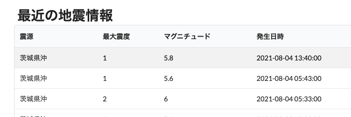
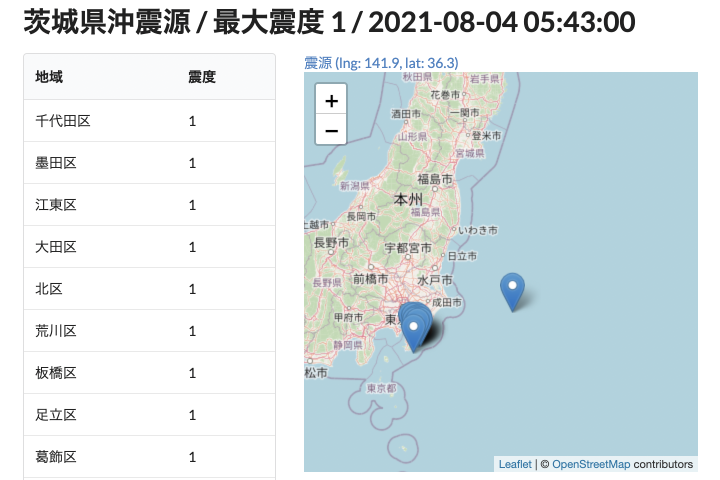

# Practice of Next.js - Earthquake information

Practice of Next.js by @dayflower




An earthquake information site,
data derived from [JMA site](https://www.jma.go.jp/bosai/map.html#elem=int&contents=earthquake_map),
powered by the following technologies.

- [Next.js](https://nextjs.org/) [with-typescript-eslint-jest](https://github.com/vercel/next.js/tree/master/examples/with-typescript-eslint-jest)
- [Jotai](https://github.com/pmndrs/jotai)
  - Added to package.json, but not used.
- [SWR](https://swr.vercel.app/)
- [Fomantic-UI](https://fomantic-ui.com/)
- [Semantic UI React](https://react.semantic-ui.com/)
- [React Leaflet legacy v2.x](https://react-leaflet-v2-docs.netlify.app/)
- [Day.js](https://day.js.org/)
- [isomorphic-unfetch](https://www.npmjs.com/package/isomorphic-unfetch)
- [Jest](https://jestjs.io/)
  - Added to package.json, but not used.

## How to use

```bash
npm run dev
```
